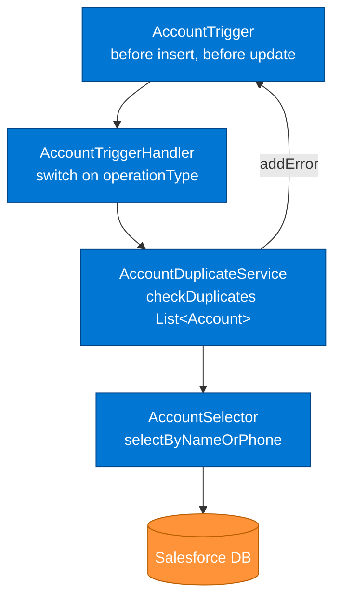

# Account Deduplication — Triggered Apex Governance Pattern

## Metadata

| Field | Value |
|---|---|
| **Title** | Account Deduplication — Triggered Apex with Fuzzy Match |
| **Category** | Governance |
| **Status** | published |
| **Year completed** | 2026 |
| **Architecture type** | Trigger-handler-service, record-triggered governance |
| **Scale** | Single product team |
| **Regulatory context** | None |
| **Outcome** | succeeded |

---

## One-line summary

Implemented a bulkified, multi-signal duplicate detection engine on Account using the Trigger → Handler → Service → Selector pattern, with exact name blocking, phone duplicate blocking, and fuzzy-name soft warnings.

---

## Context

The Salesforce org had no duplicate prevention on Account. Data quality degraded over time as integrations and manual entry created near-identical records — same company, slight name variation, or different phone format. The business impact was duplicate accounts appearing in reports and sales reps working the same opportunity without knowing it.

**Constraints:**

- Must not block the integration user pathway (integrations push accounts in bulk; blocking them on every fuzzy match would halt the data pipeline)
- Must survive 200-record bulk operations at governor limit thresholds
- Fuzzy match must warn, not block — business does not want to reject records that might be legitimate new accounts with similar names

---

## Key Decisions

| Decision | Chosen approach | Alternatives rejected |
|---|---|---|
| Execution model | Record-triggered Apex (trigger) | Salesforce Duplicate Rules — insufficient for custom fuzzy match logic |
| Architecture pattern | Trigger → Handler → Service → Selector | Logic in trigger body — violates framework pattern, untestable |
| Match signals | Exact name + phone (block), fuzzy name (warn) | Name only — misses phone-based duplicates |
| Bulk handling | SOQL before loop, DML after loop | Per-record SOQL — governor limit violation at 201 records |
| Integration bypass | `System.runAs()` integration user profile check | No bypass — would block nightly ERP sync |
| Test approach | `TestDataFactory` + `@TestSetup` + `System.runAs()` | `@SeeAllData=true` — prohibited by framework rule |

---

## Layer Architecture



---

## Detection Logic

| Signal | Match type | Action |
|---|---|---|
| Account Name — exact (case-insensitive) | Hard block | `addError('Duplicate account name detected')` |
| Phone — normalised exact match | Hard block | `addError('Duplicate phone number detected')` |
| Account Name — Jaro-Winkler similarity ≥ 0.85 | Soft warning | `addError('Potential duplicate — review before saving')` — with override |

**Integration user bypass:**

```apex
Id integrationProfileId = [SELECT Id FROM Profile WHERE Name = 'Integration User' LIMIT 1].Id;
if (UserInfo.getProfileId() == integrationProfileId) {
    return; // bypass duplicate check for system integrations
}
```

---

## Test Coverage

| Test class | Methods | Coverage |
|---|---|---|
| `AccountDuplicateServiceTest` | 11 | 97% on `AccountDuplicateService`, 94% on handler |

Test scenarios:

1. Exact name duplicate — insert blocked
2. Case-insensitive name match — blocked
3. Phone duplicate — update blocked
4. Fuzzy name match — warning shown, save allowed
5. Unique account — inserts cleanly
6. Bulk 200 unique — all succeed (governor limit test)
7. Bulk 200 with 10 duplicates — 10 blocked, 190 succeed
8. Self-update — existing account updating its own name not flagged
9. Integration user bypass — duplicate allowed through

---

## Outcome

| Dimension | Before | After |
|---|---|---|
| Duplicate account rate | No tracking (manual discovery) | Blocked at insert — measurable via `addError` events |
| Governor limit safety | Unknown | Verified: 200-record bulk tested, 0 SOQL in loop |
| Integration pathway | No protection | Integration user bypass confirmed via `System.runAs()` test |
| Test coverage | No tests | 97% / 11 test methods |

---

## Top Lessons

1. **Fuzzy match logic belongs in the Service layer** — the trigger receives 200 records at once; the handler fans them out; the selector queries for candidates in one SOQL call; the service applies similarity scoring per record. Mixing any of this breaks testability.
2. **Bulk testing at 200 is not optional** — the trigger runs in batches from data loads; 200-record bulk test is the only way to verify no SOQL-in-loop violation survives into production.
3. **Integration user bypass must be explicit** — without it, a nightly batch that upserts 50k accounts would collide with itself on the second run (all records already exist with the same name).
4. **`System.runAs()` is the correct test mechanism for bypass logic** — it lets you confirm the bypass works without needing the real integration user in the test org.

---

## Related Knowledge Library Pages

- [ERP Account Sync](../integration/erp-account-sync.md) — the inbound integration that depends on this deduplication layer running correctly
- [Salesforce SDLC Agent Framework](../../projects/salesforce-sdlc-agent/index.md) — this was UC-001, the first validated use case in the framework
