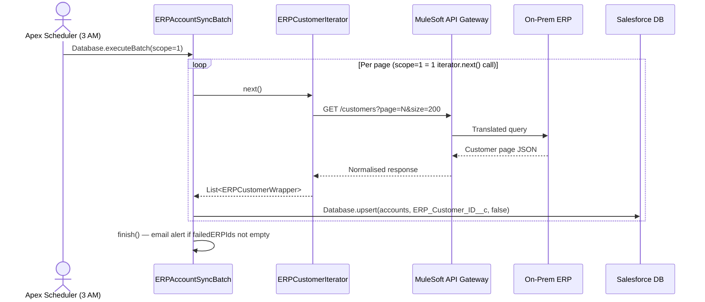

# ERP Account Sync — Inbound Integration Architecture

## Metadata

| Field | Value |
|---|---|
| **Title** | ERP Account Sync — Inbound Integration via Batch Apex |
| **Category** | Integration |
| **Status** | published |
| **Year completed** | 2026 |
| **Architecture type** | Batch integration, API-sourced iterable pattern |
| **Scale** | Single product team |
| **Regulatory context** | None |
| **Outcome** | succeeded |

---

## One-line summary

Designed and validated an inbound ERP-to-Salesforce account synchronisation pattern using API-sourced Batch Apex with Iterable/Iterator, catching 19 architectural gaps in the agent framework during end-to-end simulation.

---

## Context

An on-premises ERP system holds the master customer record for all accounts. Salesforce is the CRM but was not staying in sync — account names, segments, and statuses diverged over time. The business requirement was a nightly sync: pull all active ERP customers and upsert them into Salesforce Accounts.

**Constraints:**

- >50,000 ERP customer records — bulk-safe design required
- ERP exposed a paginated REST API (not a database query), meaning the source was an external system, not a Salesforce QueryLocator
- Enterprise architecture standard AS-002: all Salesforce-to-external callouts must route through MuleSoft or Azure Integration Services — no direct point-to-point
- No downtime window — sync must run nightly without affecting daytime org performance

---

## Key Decisions

| Decision | Chosen approach | Alternatives rejected |
|---|---|---|
| Batch source mechanism | Iterable + Iterator (API-sourced) | `Database.QueryLocator` — wrong; queries Salesforce not ERP |
| Middleware layer | MuleSoft API gateway fronts ERP | Direct Apex callout to ERP — violates AS-002 |
| Match / upsert key | External ID field `ERP_Customer_ID__c` | Salesforce record Id — wrong anchor for external records |
| Error handling | `Database.Stateful` accumulates failed IDs, finish() emails alert | Fail-fast per batch — loses partial results |
| Scheduling | Schedulable wrapper, `Database.executeBatch(batch, 1)` | Cron directly on batch — doesn't allow scope control |
| Field ownership protection | `ERPFieldMapping__mdt` Custom Metadata | Hardcoded field list in service class — brittle |

---

## Architecture Overview

---

## Governance Rules Applied

| Rule | Requirement | Applied here |
|---|---|---|
| R-011 | External ID fields: Text, Unique, Indexed | `ERP_Customer_ID__c` on Account — used as upsert key |
| R-012 | >10k records → Batch Apex, scope ≤200 | `ERPAccountSyncBatch` scope=1 (each execute = one API page of 200) |
| AS-002 | No direct Salesforce→ERP callouts | All callouts go via MuleSoft; Named Credential points to MuleSoft not ERP |

---

## Why Iterable — Not QueryLocator

This was the most critical architectural gap surfaced during simulation. The two patterns look similar but are architecturally opposite:

| | `Database.QueryLocator` | `Iterable<T>` |
|---|---|---|
| Data source | Salesforce records | Anything — external API, file, computed list |
| `start()` returns | SOQL query (Salesforce runs it) | Your Iterator object |
| `execute()` receives | `List<SObject>` | `List<YourWrapper>` |
| Callouts allowed | No — callouts in start() blocked | Yes — via `Database.AllowsCallouts` |
| When to use | Bulk processing of existing SF records | Pulling from an external API, file, or external DB |

Using `QueryLocator` here would have meant the batch tries to query Salesforce for records that don't exist yet — it cannot pull from an external API at all.

---

## Class Structure

| Class | Responsibility |
|---|---|
| `ERPAccountSyncSchedulable` | Schedulable — fires batch nightly at 3 AM |
| `ERPAccountSyncBatch` | Batchable + AllowsCallouts + Stateful — orchestrates sync |
| `ERPCustomerIterable` | Iterable — entry point, returns Iterator |
| `ERPCustomerIterator` | Iterator — one HTTP page call per `next()` |
| `ERPCustomerWrapper` | JSON deserialisation model |
| `ERPAccountSyncService` | Upsert logic — `Database.upsert` via `ERP_Customer_ID__c` |
| `ERPSyncErrorNotifier` | Email alert on partial failures |

---

## Gaps Found During Simulation

This case study emerged from an end-to-end agent framework simulation (2026-05). The simulation identified 19 architectural gaps — the most critical being the missing API-sourced Batch pattern. The others clustered into four themes:

| Theme | Gaps | Root cause |
|---|---|---|
| Routing logic | Orchestrator "sync" keyword misrouted | Tier 1/2/3 check was missing |
| Architect agent | No Mode 1/Mode 2 split, no AS-002 check, no TA handoff checklist | Agent instructions too generic |
| Developer agent | No TA lookup step, batch pattern not in context | Context files incomplete |
| Deployer agent | Named Credential runbook missing, Scheduled Batch post-deploy step missing | Deployment checklist gaps |

All 19 gaps were fixed in the framework before the case was closed. See [Salesforce SDLC Agent Framework — Rollout Plan](../../projects/salesforce-sdlc-agent/rollout-plan.md) for the full remediation list.

---

## Outcome

| Dimension | Before simulation | After simulation |
|---|---|---|
| API-sourced batch pattern | Not documented — developers would generate wrong pattern | Added to `framework-patterns.context.md` and `integration-callout.spec.md` |
| Governance rules R-011, R-012 | Not captured | Added to `governance-rules.context.md`; enforced by architect agent |
| Named Credential deployment | Not in deployer checklist | Runbook added with per-environment steps |
| Orchestrator routing accuracy | "sync" misrouted to developer | Tier 1/2/3 routing block added |
| Framework simulation coverage | Not tested end-to-end | Full 10-agent E2E simulation completed |

---

## Top Lessons

1. **The Iterable vs. QueryLocator distinction is non-obvious** — every developer defaults to QueryLocator because it's what every Salesforce tutorial shows; the API-sourced variant needs explicit documentation to be discoverable.
2. **Simulation beats code review for framework gaps** — running all 10 agents sequentially without manual intervention exposed gaps that no static review would have caught, because the gaps were in agent handoffs and missing context files, not in code.
3. **Architecture standards (AS-002) must be explicitly checked** — the architect agent did not verify middleware routing until a mandatory check was added to Step 2; without it, developers generate direct callouts that violate enterprise policy.
4. **Named Credentials and Scheduled Apex require manual post-deploy steps** — deploying the package.xml is not enough; both require environment-specific configuration that cannot be automated through the standard pipeline.

---

## Related Knowledge Library Pages

- [Event-Driven Architecture](../../knowledge/architecture-notes/event-driven-architecture.md) — contrasting pattern: async events vs. scheduled batch
- [API-Sourced Batch Apex Pattern](../../knowledge/architecture-notes/api-sourced-batch-apex.md) — the reusable pattern extracted from this case
- [Salesforce SDLC Agent Framework](../../projects/salesforce-sdlc-agent/index.md) — the agent framework that was tested and improved
