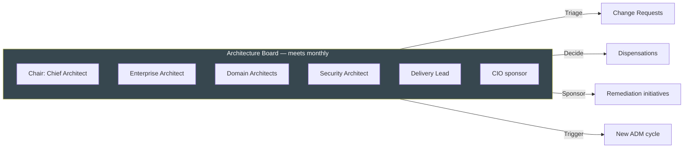

# Architecture Change Management (Phase H)

**TOGAF Reference:** Part II, Chapter 13 — Phase H
**Objective:** Establish procedures for managing changes to the new architecture once it is in life — distinguishing simplification, incremental, and re-architecting changes.

> Phase H is the *final* ADM phase before the cycle restarts. It governs change to the architecture **after** delivery is complete and the system is in production. It also decides when accumulated change pressure is large enough to trigger a new ADM cycle.

---

## Foundations

**Quick recall:** Phase H asks one question repeatedly: *given this change request, do we accommodate it within the current architecture, or does it require us to re-do the ADM?*

Three classes of change emerge from the answer:

1. **Simplification Change** — fits the current architecture; just deliver
2. **Incremental Change** — extends the architecture; needs Phase H governance
3. **Re-architecting Change** — breaks the current architecture; triggers a new ADM cycle

---

## Concepts & Relationships

```
Change Request raised
        │
        ▼
   Architecture Board triage (Change Triage)
        │
   ┌────┴──────────────┬────────────────┐
   ▼                   ▼                ▼
Simplification    Incremental      Re-architecting
   │                   │                │
   ▼                   ▼                ▼
Direct delivery   Phase H governance   New ADM cycle
                  (mini A→D→F)         (back to Preliminary or A)
```

---

## Execution Guidance

### Change Request Template

```
CHANGE REQUEST — CR-2026-027

Requestor: Customer Squad
Date raised: 2026-09-14
Title: Add real-time order-status push notifications to mobile app

Driver:
  - Customer NPS feedback: order tracking is #2 pain point
  - Competitive pressure: 3 competitors launched in last 6 months
  - Estimated revenue impact: +£1.2M/yr from reduced abandoned baskets

Affected components:
  - Mobile app (front-end)
  - Order Service (event emission already exists)
  - Notification Service (extend; currently email only)
  - WebSocket / push gateway (new component required)

Change classification (proposed):
  [X] Incremental — extends current architecture (event-driven backbone exists,
                    new front-end channel and gateway component needed)
  [ ] Simplification — within current architecture
  [ ] Re-architecting — requires new ADM

Architectural implications:
  - New SBB: push gateway (Firebase Cloud Messaging or similar)
  - Extension to Notification Service contract (new channel: push)
  - Mobile app needs persistent connection or push token registration
  - PII handling: device tokens are personal data → update Data Architecture register

Impact on standards:
  - May require new ADR: choice of push provider
  - Update Phase D Technology Architecture (new SBB)

Effort estimate: M (3 months, one squad)

Triage decision:
  [ ] Approved as Simplification
  [X] Approved as Incremental — proceed to Phase H mini-ADM
  [ ] Escalate as Re-architecting — trigger new ADM cycle
  [ ] Rejected — reason: ____________________

Decision date: __________  Decided by: __________
```

### Phase H Mini-ADM (for Incremental Changes)

For Incremental changes, run an abbreviated ADM cycle scoped to the change:

| Mini-Phase | Activity | Deliverable |
|---|---|---|
| Mini-A | Reaffirm vision; scope confirmed | Updated Statement of Work |
| Mini-B/C/D | Update affected B/C/D architecture sections only | Updated Architecture Definition Document (delta) |
| Mini-E/F | Plan delivery | Mini-Roadmap, updated Migration Plan |
| Mini-G | Govern delivery | Compliance reviews scheduled |
| Mini-H | Re-baseline architecture | Updated repository |

This is **lighter** than a full ADM — typically 4–8 weeks of architecture work instead of months.

### When to Trigger a Full New ADM Cycle

**Guided practice:** trigger a new full ADM cycle when **any two** of the following are true:

- A material change to business strategy or operating model
- A new regulatory regime
- Substantial M&A activity (acquired or divested entity)
- More than 30% of the application portfolio is being changed simultaneously
- Architectural debt in the variance log has reached "remediate or rebuild" threshold
- The current target architecture is more than 3 years old and largely realised

### Architecture Board Governance Model

The Architecture Board (or equivalent) is the standing body that:

- Triages Change Requests (classifies them)
- Approves Dispensations
- Sponsors major remediation initiatives
- Decides when to trigger a new ADM cycle



**Quorum and decision rules:**

- Quorum: Chair + 3 architects + 1 delivery representative
- Decisions are by consensus; Chair has casting vote on tie
- Decisions are recorded; rationale captured for the audit trail
- Decisions can be overridden only by CIO/CTO — and the override is itself recorded

---

## Analysis & Insights

**Deep reasoning:** Phase H is where architecture either stays *current* or becomes *legacy decoration*. The most common failure: the Architecture Board exists but never reviews change requests systematically, so individual teams make architecturally-significant changes without governance and the documented architecture diverges silently from the as-built reality.

The remedy is *proactive* triage — every architecturally-significant change request hits the Board before delivery starts, not after.

---

## Decision Frameworks

**Judgment & trade-offs:** when classifying a change request:

| Indicator | Lean towards Simplification | Lean towards Incremental | Lean towards Re-architecting |
|---|---|---|---|
| Affected components | One | A few | Many |
| New ABBs/SBBs needed? | None | One or two | Many |
| Affects integration patterns? | No | Extension | Replacement |
| Affects data ownership? | No | Possibly | Yes |
| Affects core capability map? | No | No | Yes |
| Effort to deliver | Days–weeks | Weeks–months | Months–years |

When in doubt between Incremental and Re-architecting, choose the *more rigorous* classification — better to over-govern a single change than under-govern a programme.

---

## Target Outputs

- [ ] Change Management process documented and adopted
- [ ] Change Request register — current
- [ ] Triage decisions recorded for every CR
- [ ] Architecture Board terms of reference — current
- [ ] Re-architecting trigger criteria — agreed and visible
- [ ] Architecture Repository — refreshed after each Incremental change

**Synthesis exercise:** review your last 12 months of significant production changes. For each, identify whether it would have been classified Simplification, Incremental, or Re-architecting. How many bypassed governance? What architectural drift resulted?

---

## Tools & Credible Sources

| Tool / Source | Use for | Notes |
|---|---|---|
| TOGAF Standard 10ed — [Chapter 13](https://pubs.opengroup.org/architecture/togaf10-doc/arch/chap13.html) | Authoritative reference | Free online |
| Open Group Architecture Forum publications | Patterns for architecture governance | Some content paywalled |

---

## Acceleration Using AI

LLMs can be used to:

- First-pass classification of Change Requests against the trade-off matrix above
- Generate Architecture Board minute drafts from raw discussion notes
- Detect drift between the documented architecture and a recent code review

**Bias warning:** LLMs over-classify changes as Simplification (path of least resistance). Always require justification against the trade-off table.

---

## Common Mistakes

!!! failure "Architecture Board exists on paper only"
    A board with no scheduled meetings, no quorum rules, and no decision log is not a governance body — it is a phone tree.

!!! warning "Never triggering a new ADM cycle"
    If your last full ADM was more than 5 years ago and your business has materially changed, your architecture is fiction.

!!! tip "Refresh annually"
    Even if no major change has occurred, walk the Architecture Board through the current state once a year to surface drift.

---

## Related

- [Implementation Governance (Phase G)](implementation-governance.md) — paired phase, during delivery
- [Governance Framework](../reference/governance-framework.md) — standing governance bodies and processes
- [Preliminary](preliminary.md) — where a new ADM cycle starts
- [Decision Records](../decision-records/index.md)
