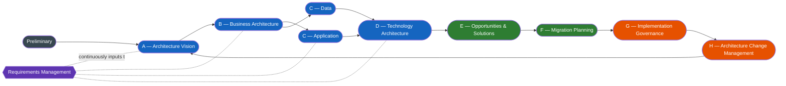

# Architecture Development Method (TOGAF ADM)

The ADM is the iterative method at the heart of TOGAF. Each phase produces specific deliverables that feed the next phase.

## Pages

- [Preliminary](preliminary.md)
- [Architecture Vision (A)](architecture-vision.md)
- [Business Architecture (B)](business-architecture.md)
- [Information Systems Architecture (C)](information-systems/index.md)
    - [Application Architecture](information-systems/application-architecture.md)
    - [Data Architecture](information-systems/data-architecture.md)
- [Technology Architecture (D)](technology-architecture.md)
- [Opportunities & Solutions (E)](opportunities-and-solutions.md)
- [Migration Planning (F)](migration-planning.md)
- [Implementation Governance (G)](implementation-governance.md)
- [Architecture Change Management (H)](change-management.md)
- [Requirements Management (continuous)](requirements-management.md)

## How the ADM is Used Here

This Knowledge Library treats the ADM as a **structuring device for reference content**, not as a step-by-step delivery method. For step-by-step engagement work, use the [Engagement Playbook](../../playbook/engagement/index.md).

> Each phase page contains foundations, execution guidance, judgment & trade-offs, target outputs, and a synthesis exercise. The order is consistent across all phase pages so you can scan them in the same way each time.
