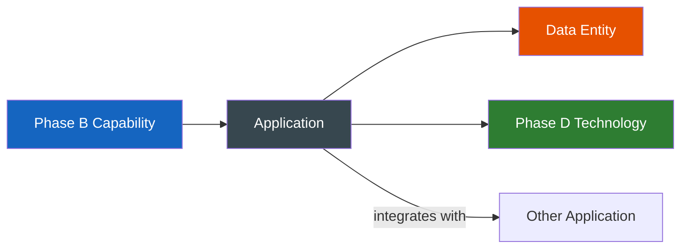

# Application Architecture (Phase C — Sub-Phase)

**TOGAF Reference:** Part II, Chapter 8 — Phase C (Application Architecture sub-phase)
**Objective:** Provide a blueprint for the individual application systems to be deployed, their interactions, and their relationships to the core business processes.

> Phase C is a paired sub-phase: **Application Architecture** (this page) and **Data Architecture** are typically developed in parallel because they constrain each other. Always read them as a pair.

---

## Foundations

**Quick recall:** Application Architecture answers *which applications exist, what they do, how they interact, and who owns them*. It is application-level logical design — not code, not infrastructure, not data schemas.

The deliverable is *not* a long list of apps; it's an **agreed application portfolio** that maps to business capabilities and a **target landscape** that closes the gaps.

---

## Concepts & Relationships

**Conceptual understanding:** Each application in the portfolio supports one or more business capabilities (from Phase B). It produces and consumes data entities (from the Data Architecture sub-phase). It runs on technology services (Phase D). It must be re-derivable from these three things — never invented.

```
Phase B Capability ──supported by──> Application ──runs on──> Phase D Technology
                                          │
                                          ├──produces/consumes──> Data Entity (Phase C Data)
                                          └──integrates with────> Other Applications
```

If you cannot trace an application back to a capability, either the capability is missing from Phase B, or the application has no business reason to exist.

---

## Execution Guidance

### Inputs

| Input | Source |
|---|---|
| Business Architecture (capability map, processes) | Phase B |
| Existing application catalogue (if any) | Architecture Repository / CMDB |
| Integration inventory | Architects / Operations |
| ADRs constraining application choices | Decision records |

### Application Portfolio

Catalogue all applications in scope — baseline and planned:

| Application | Type | Business Capability | Status | Technology | Owner |
|---|---|---|---|---|---|
| Monolith Platform | Legacy | All | To be decomposed | Java 8, Oracle | Platform Squad |
| API Gateway | Infrastructure | Routing, Auth, Rate-limiting | Target | Kong | Platform Squad |
| Order Service | Domain service | Order Management | To build | Java 21, Spring Boot 3 | Orders Squad |
| Inventory Service | Domain service | Inventory Management | To build | Go 1.22 | Fulfilment Squad |
| Notification Service | Domain service | Customer Notifications | To build | Node.js 20 | CX Squad |
| Product Catalogue | Domain service | Product Management | To build | Python / FastAPI | Product Squad |
| Customer SPA | Front-end | All customer-facing | To modernise | React 18 | CX Squad |
| Analytics Platform | Platform | Analytics & Reporting | Target | Redshift + dbt | Data Platform |

### Application Interaction Diagram (C4 Container — Level 2)

For TOGAF-style modelling, use ArchiMate Application Collaboration notation. See the [ArchiMate Reference](../../reference/archimate.md).

For implementation-team conversations, the C4 Container Diagram is more accessible — see [Phase 2 Design](../../../playbook/engagement/02-design.md#3-c4-model-diagrams).

### Integration Catalogue

**Guided practice:** for each cross-application interaction, capture the row below. If you cannot fill in the *Pattern* and *Data Exchanged* columns, the integration is not designed yet — only assumed.

| Integration | Producer | Consumer | Pattern | Protocol | Data Exchanged |
|---|---|---|---|---|---|
| Order → Payment | Order Service | Payment Service | Sync REST | HTTPS | Order total, customer token |
| Order → Inventory | Order Service | Inventory Service | Async Event | SNS/SQS | OrderPlaced event |
| Order → Notification | Order Service | Notification Service | Async Event | SNS/SQS | OrderPlaced, OrderFulfilled |
| User Auth | API Gateway | Okta / Keycloak | Sync | OIDC / JWT | Access token validation |
| Product → Order | Product Catalogue | Order Service | Sync REST | HTTPS | Product price, availability |

### Application Gap Analysis

| Application | Baseline | Target | Gap | Action |
|---|---|---|---|---|
| Authentication | Custom session auth in monolith | OAuth 2.0 / OIDC | Integrate IdP; remove legacy auth | Phase E |
| Order processing | Monolith module | Independent Order Service | Extract; define event contracts | Phase E |
| Front-end | Server-rendered JSP | React SPA | Rewrite (or incremental migration) | Phase E/F |
| Analytics | Manual BI reports | Self-service dashboards | Data platform initiative | Separate programme |

---

## Analysis & Insights

**Deep reasoning:** the most common failure mode is an application catalogue that is *complete* but *not actionable*. Each row must answer:

1. **Who owns it?** — a named squad/team, not "Engineering"
2. **What capability does it serve?** — must trace to Phase B
3. **What is its lifecycle status?** — invest / maintain / migrate / retire
4. **What integrates with it?** — the integration catalogue is the connectivity truth

If any of these are blank, the row is decoration.

---

## Decision Frameworks

**Judgment & trade-offs:** when designing the application landscape, the recurring trade-offs are:

| Trade-off | Lean towards… when | Lean away when |
|---|---|---|
| **Build vs. Buy** | The capability is differentiating | A mature SaaS exists and the capability is undifferentiated |
| **Monolith vs. Microservices** | Team size < 8, domain unclear, low scale | Multiple teams, clear bounded contexts, scale forcing function |
| **Sync REST vs. Async Events** | A user is waiting for the result | One service reacts to another's state change |
| **One large service vs. many small** | Strong cohesion, one team | Independent change cadence per capability |
| **Front-end monolith vs. micro-frontends** | One front-end team, one product | Multiple teams owning distinct UI areas |

Recorded application choices belong in [Decision Records](../../decision-records/index.md).

---

## Target Outputs

- [ ] Application Portfolio — complete and current
- [ ] Application Interaction Catalogue — complete
- [ ] Application Architecture Gap Analysis — complete
- [ ] Architecture Definition Document (Application section) — drafted
- [ ] Candidate Architecture Roadmap components — identified
- [ ] Architecture Repository updated

**Synthesis exercise:** pick one cross-domain user journey (e.g., "place an order"). Draw the integration sequence diagram, label each integration with its pattern (sync/async), and check whether each producer/consumer pair appears in your Integration Catalogue. Any missing rows are real gaps.

---

## Decision Guides & Visuals



---

## Tools & Credible Sources

| Tool / Source | Use for | Notes |
|---|---|---|
| ArchiMate 3.2 (Application layer) | Formal notation | Best for cross-stakeholder communication; steep learning curve |
| C4 Model (Container diagrams) | Engineering-team conversations | Lighter weight; less formal mapping to TOGAF |
| TOGAF Standard 10ed — [Chapter 8](https://pubs.opengroup.org/architecture/togaf10-doc/arch/chap08.html) | Authoritative reference | Free online |
| `microservices.io` (Chris Richardson) | Pattern catalogue for distributed apps | Vendor-neutral |

---

## Acceleration Using AI

A capable LLM can be used to:

- Draft the first-pass Application Portfolio from a list of running services + their READMEs
- Generate Integration Catalogue rows from sequence diagrams or API specs
- Spot inconsistencies between the App Portfolio and Phase B capability map

**Bias warning:** LLMs over-confidently propose microservices and event-driven patterns. Apply the trade-off table above before accepting suggestions.

---

## Common Mistakes

!!! failure "Application catalogue without ownership"
    An application catalogue with no named owner is not actionable. Every application needs a squad or team accountable for it.

!!! warning "Confusing components with applications"
    A library, a database, or a network appliance is not an application. An application is a deployable, owned, capability-supporting unit.

---

## Related

- [Data Architecture (Phase C — Sub-Phase)](data-architecture.md) — the paired sub-phase
- [Business Architecture (Phase B)](../business-architecture.md) — the source of capabilities this addresses
- [Technology Architecture (Phase D)](../technology-architecture.md) — what this runs on
- [ArchiMate Reference](../../reference/archimate.md)
- [Patterns](../../reference/patterns.md)
