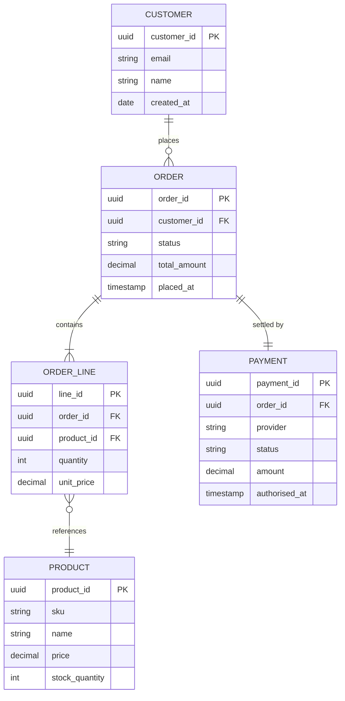
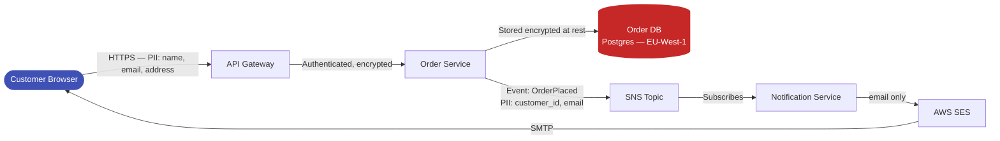
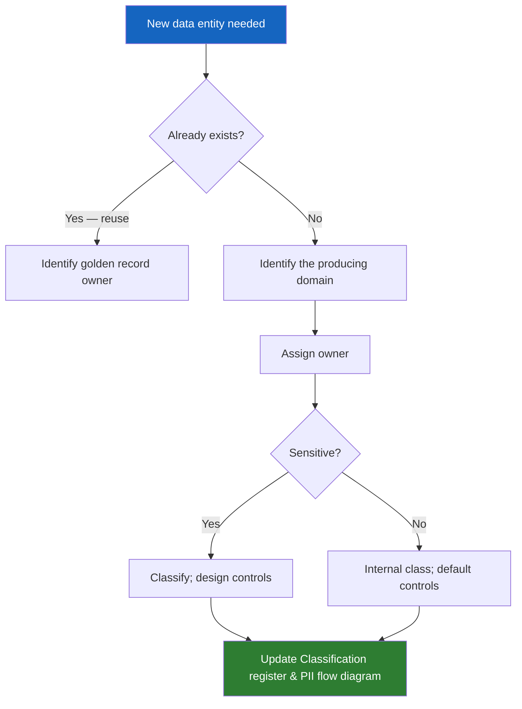

# Data Architecture (Phase C — Sub-Phase)

**TOGAF Reference:** Part II, Chapter 8 — Phase C (Data Architecture sub-phase)
**Objective:** Describe the structure of the organisation's logical and physical data assets and data management resources, and how they support the Target Business Architecture.

> Phase C is a paired sub-phase: **Data Architecture** (this page) and **[Application Architecture](application-architecture.md)** are developed together because they constrain each other.

---

## Foundations

**Quick recall:** Data Architecture answers *what data the enterprise treats as an asset, who owns it, where it lives, how it's classified, and how it flows*. It is **conceptual and logical** — not table design.

The deliverable set: a **conceptual data model**, a **data ownership map**, a **classification register**, and **PII data flow diagrams** for any regulated data.

---

## Concepts & Relationships

**Conceptual understanding:** data is the thing applications produce, consume, and persist. Data Architecture exists so that:

- Each business-meaningful entity has **one authoritative source** (single source of truth)
- Each data entity has **a named owner** accountable for its quality, lifecycle, and access
- Sensitive data is **classified** so that controls match risk
- Cross-domain data flows are **explicit** — auditable, and reviewable for compliance

```
Phase B Capability ──needs──> Data Entity ──owned by──> Domain
                                  │
                                  ├──classified as──> {Public | Internal | Confidential | Restricted}
                                  ├──persisted in──> Data Store
                                  └──flows through──> Application(s) (Phase C App)
```

---

## Execution Guidance

### Conceptual Data Model

Define major data entities, their relationships, and the business capability they belong to. This is a **communication tool**, not a physical schema.



### Data Domain Ownership (Data Mesh-aligned)

**Guided practice:** align data ownership to business domains, not to where the data physically lives today.

| Data Domain | Owner Squad | Golden Record? | Consumers |
|---|---|---|---|
| Customer | CX Squad | Yes | Orders, Notifications, Analytics |
| Product Catalogue | Product Squad | Yes | Orders, Inventory, Search |
| Orders | Orders Squad | Yes | Payments, Fulfilment, Analytics |
| Inventory | Fulfilment Squad | Yes | Orders, Product Catalogue |
| Payments | Finance Squad | Yes | Orders, Finance Reporting |
| Analytics / Events | Data Platform | No (derived) | Reporting dashboards |

### Data Classification

| Classification | Description | Example Data | Controls Required |
|---|---|---|---|
| **Public** | No harm if disclosed | Product catalogue, public pricing | None |
| **Internal** | Intended for employees only | Internal metrics, org charts | Access controls |
| **Confidential** | Could harm the business if disclosed | Business plans, contracts | Encryption, access review |
| **Restricted** | Personal or regulated data | PII, payment card data, health | GDPR controls, encryption at rest & transit, audit log |

### PII Data Flow Diagram

Document all flows involving Restricted data. Required for GDPR Article 30 (Record of Processing Activities).



**Key controls for PII flows:**

- [ ] TLS 1.2+ on all data in transit
- [ ] Encryption at rest (AES-256) for all Restricted data stores
- [ ] PII never in logs (log sanitisation)
- [ ] Access to PII stores: role-based, audited, least privilege
- [ ] GDPR retention periods defined and enforced for each data entity

### Data Architecture Gap Analysis

| Data Entity / Store | Baseline | Target | Gap | Action |
|---|---|---|---|---|
| Customer data | Stored in monolith Oracle DB | Owned by CX domain; PostgreSQL; API-accessible | Extract; define data contract | Phase E |
| Product data | Shared Oracle schema | Product catalogue service; event-sourced | Design event schema; migrate | Phase E |
| Analytics | Batch SQL export nightly | Streaming to data lake (S3) | Build streaming pipeline | New initiative |
| PII retention | No automated deletion | Automated deletion at retention period | Implement TTL / scheduled job | Phase E/G |

---

## Analysis & Insights

**Deep reasoning:** Data Architecture goes wrong in three predictable ways:

1. **Schema design too early** — designing tables before agreeing on ownership locks-in the wrong owner
2. **No classification** — without classification, you cannot risk-assess flows or apply proportionate controls
3. **PII flows undocumented** — discovered during audit, not by design

---

## Decision Frameworks

**Judgment & trade-offs:** when settling data ownership disputes, use this hierarchy:

| Question | If unclear, the owner is… |
|---|---|
| Who created the data? | The producer (default) |
| Who has the authoritative business definition? | The domain owner of the definition |
| Who is regulatory-accountable for it (GDPR, PCI)? | The accountable owner — overrides others |
| If still unclear | Escalate to Data Governance Council |

Compare with the [decision records](../../decision-records/index.md) — significant data ownership choices belong as ADRs.

---

## Target Outputs

- [ ] Conceptual Data Model — complete for in-scope entities
- [ ] Data Domain Ownership table — agreed with data owners
- [ ] Data Classification register — complete for all data entities in scope
- [ ] PII Data Flow Diagram — complete; reviewed by privacy/legal
- [ ] Data Architecture Gap Analysis — complete
- [ ] Architecture Definition Document (Data section) — drafted
- [ ] Architecture Repository updated

**Synthesis exercise:** pick one Restricted data entity in your environment. Draw its full data flow from creation to deletion. List every system that touches it. For each, mark whether the access is necessary, audited, and within retention policy. Anything left unmarked is a finding.

---

## Decision Guides & Visuals



---

## Tools & Credible Sources

| Tool / Source | Use for | Notes |
|---|---|---|
| ArchiMate 3.2 (Business + Application layer data objects) | Modelling notation | Use BusinessObject for conceptual; DataObject for logical |
| Data Mesh (Zhamak Dehghani) | Distributed data ownership | Aligns with TOGAF Phase C; not a tool — a paradigm |
| TOGAF Standard 10ed — [Chapter 8](https://pubs.opengroup.org/architecture/togaf10-doc/arch/chap08.html) | Authoritative reference | Free online |
| GDPR Article 30 | Records of Processing | Mandatory for EU PII processors |
| `martinfowler.com/articles/data-mesh-principles.html` | Data Mesh primer | Vendor-neutral |

---

## Acceleration Using AI

LLMs can be used to:

- Generate first-draft conceptual data models from natural-language domain descriptions
- Draft data flow diagrams from a list of integrations
- Highlight PII fields in API specs

**Bias warning:** LLMs invent fields and relationships that aren't in your domain. Treat output as a *first draft to validate*, not a model.

---

## Common Mistakes

!!! failure "Data architecture as a database design exercise"
    TOGAF Phase C data architecture is conceptual and domain-level. It is not about table design. Conflating the two leads to premature physical design decisions before logical ownership is agreed.

!!! warning "PII flow diagram missing"
    If a regulator asks for an Article 30 record and you cannot produce a current PII data flow diagram in five minutes, you do not have one. Build it during Phase C, not during the audit.

!!! tip "Data mesh for distributed architectures"
    For microservices or distributed contexts, the Data Mesh pattern (Zhamak Dehghani) aligns naturally with TOGAF Phase C — treat data as a product, owned by the domain that produces it.

---

## Related

- [Application Architecture (Phase C — Sub-Phase)](application-architecture.md) — the paired sub-phase
- [Business Architecture (Phase B)](../business-architecture.md)
- [Patterns](../../reference/patterns.md) — CQRS, Event Sourcing, Saga
- [ADR-001 Shared Database](../../decision-records/ADR-001-shared-database.md), [ADR-003 Database-per-Service](../../decision-records/ADR-003-database-per-service.md)
