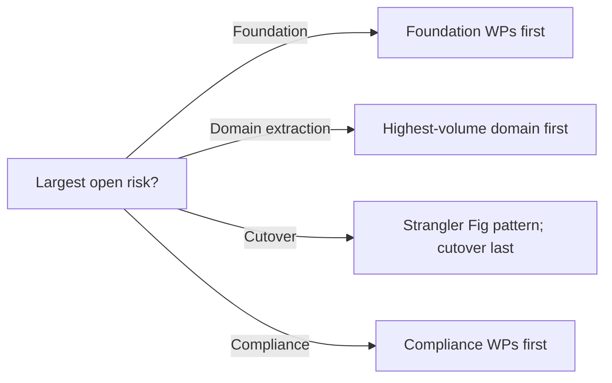

# Migration Planning (Phase F)

**TOGAF Reference:** Part II, Chapter 11 — Phase F
**Objective:** Finalise the Architecture Roadmap and supporting Implementation and Migration Plan, ensuring it is properly prioritised, resourced, and governed.

> Phase F turns Phase E's *initial* roadmap into a fully **governed Migration Plan** — with prioritisation models, cost & benefit estimates, resource plans, and the formal Architecture Contract that hands over to delivery teams.

---

## Foundations

**Quick recall:** Phase F is where architecture transitions from design to *delivery commitment*. The Migration Plan is the living document that delivery teams, sponsors, and the Architecture Board all reference.

---

## Concepts & Relationships

```
Phase E Output (Initial Roadmap, WPs, TAs)
            │
            ▼
   Prioritisation (cost/benefit/risk)
            │
            ▼
   Resourced & dated Migration Plan
            │
            ▼
   Architecture Contract (handover to delivery)
            │
            ▼
   Phase G (Implementation Governance)
```

---

## Execution Guidance

### Prioritisation Model

**Guided practice:** score every Work Package on three axes; the score determines sequencing.

| Work Package | Business Value (1-5) | Risk Reduction (1-5) | Effort (1-5, lower = better) | Score = (Value + Risk) / Effort |
|---|---|---|---|---|
| WP-01 Platform | 3 | 5 | 4 | 2.0 |
| WP-04 Order Service | 5 | 4 | 5 | 1.8 |
| WP-06 Customer Service | 4 | 3 | 4 | 1.75 |
| WP-09 Analytics | 5 | 2 | 3 | 2.33 |
| WP-08 Monolith Retire | 2 | 5 | 4 | 1.75 |

The model is a *starting point for conversation*, not a verdict. Sponsors will override it for political or strategic reasons — capture those overrides in writing.

### Migration Plan Structure

The Migration Plan is the canonical reference document for delivery. It should contain:

1. **Roadmap** — finalised version of the Phase E Gantt
2. **Per–Work Package detail** — owner, dates, dependencies, success criteria, exit criteria
3. **Resource plan** — squads/teams allocated; gaps in capacity flagged
4. **Cost plan** — capital + operational forecast per quarter
5. **Risk register** — top risks with owners and mitigations
6. **Communication plan** — who hears what, when
7. **Decision log** — significant choices made during planning, linked to ADRs

### Architecture Contract

The Architecture Contract is the formal handover from Architecture to Delivery. It establishes accountability for *delivering to the architecture*, not deviating without governance.

```
ARCHITECTURE CONTRACT — WP-04 Order Service

Parties:
  - Architect: [Name]
  - Delivery Lead: [Name]
  - Sponsor: [Name]

Scope:
  Deliver the Order Service as defined in [link to Architecture Definition Doc § Order Service]
  with capabilities listed in Section 4 of that document.

Architectural Constraints (must comply):
  - Implements the OrderPlaced event contract v1.0 [link]
  - Uses PostgreSQL (per ADR-003)
  - Deploys to EKS cluster (per WP-01 platform)
  - Emits structured logs in JSON; metrics to Prometheus
  - Authentication via OIDC (per ADR-005)

Acceptance Criteria:
  - Functional: [link to story acceptance]
  - Non-functional: 99.9% availability; p95 latency < 200ms; RPO 5min/RTO 30min
  - Security: passes SAST, DAST, dependency scan
  - Compliance: PII handling per Data Architecture Phase C [link]

Variations & Dispensations:
  Any deviation from Architectural Constraints requires a Dispensation Request
  approved by the Architecture Board before being released to production.

Reviewable At:
  - Iteration 3 architecture review
  - Pre-production architecture review
  - Annually after go-live

Signatures:
  Architect: ____________  Date: ______
  Delivery Lead: ________  Date: ______
  Sponsor: _____________   Date: ______
```

### Cost & Benefit Estimation

For each Work Package, estimate (with confidence intervals):

| Work Package | Capex | Opex Year 1 | Benefit Year 1 | Benefit Year 3 (cumulative) | Confidence |
|---|---|---|---|---|---|
| WP-01 Platform | £180k | £60k/yr | -£60k (cost only) | -£60k (foundation) | High |
| WP-04 Order Service | £320k | £40k/yr | £150k (faster releases) | £600k | Medium |
| WP-09 Analytics | £450k | £80k/yr | £200k (faster decisions) | £900k | Low |

Low-confidence rows need either a spike to improve confidence, or explicit acceptance of risk.

### Risk-Based Sequencing

When in doubt, sequence to **kill the largest risk first**. If platform stability is the biggest risk, do platform first even if its own value is foundation-only.



---

## Analysis & Insights

**Deep reasoning:** the Migration Plan must survive contact with delivery. The two failure modes:

1. **Plan is too detailed too early** — every WP has dates and resource names assigned 18 months out. Delivery shifts the plan in week 6 and nobody trusts it again.
2. **Plan is too vague** — high-level themes only, no per-WP commitment. Delivery teams have no contract; sponsors have no commitment to track.

The correct level of detail: **fully committed for the next 90 days, indicative for 6 months, directional beyond**. Re-plan quarterly.

---

## Decision Frameworks

**Judgment & trade-offs:**

| Decision | Lean towards… when | Lean away when |
|---|---|---|
| **Detailed plan vs. rolling-wave** | Mature delivery; predictable scope | Discovery still ongoing; high-uncertainty WPs |
| **All WPs in flight vs. WIP-limited** | Excess capacity; clear coordination | Tight resource; risk of context switching |
| **Architecture Contract vs. lightweight RACI** | Regulated, multi-team, long-duration | Single-team, short-duration, low-risk |

---

## Target Outputs

- [ ] Prioritisation model — populated for all WPs
- [ ] Migration Plan — current; reviewed by sponsor
- [ ] Per-WP Architecture Contracts — drafted, signed for next-90-day WPs
- [ ] Cost & Benefit estimates — at agreed confidence
- [ ] Risk register — current
- [ ] Resource plan — gaps flagged
- [ ] Communications plan — agreed
- [ ] Architecture Repository updated (Roadmap + Migration Plan)

**Synthesis exercise:** take a real-world programme. Audit its Migration Plan against this list. For any missing item, ask: *what bad outcome is currently un-managed?* Each missing artefact maps to a specific risk.

---

## Tools & Credible Sources

| Tool / Source | Use for | Notes |
|---|---|---|
| Lean Portfolio Management (SAFe) | Prioritisation | Useful complement to TOGAF Phase F prioritisation |
| Cost of Delay | Sequencing argument | Reinertsen — "Principles of Product Development Flow" |
| TOGAF Standard 10ed — [Chapter 11](https://pubs.opengroup.org/architecture/togaf10-doc/arch/chap11.html) | Authoritative reference | Free online |

---

## Acceleration Using AI

LLMs can be used to:

- Draft an Architecture Contract from a Work Package description
- Compute the prioritisation score and flag tied/very-close items
- Audit a Migration Plan against the target-outputs list

**Bias warning:** LLMs are weak at confidence intervals — they tend to produce point estimates. Always require *Low/Medium/High confidence* in any cost or benefit estimate.

---

## Common Mistakes

!!! failure "No Architecture Contract"
    Without a contract, Delivery and Architecture disagree later about what was committed. Always sign one per Work Package, even if lightweight.

!!! warning "Re-planning too rarely"
    A plan more than 90 days stale is fiction. Re-plan quarterly minimum.

---

## Related

- [Opportunities & Solutions (Phase E)](opportunities-and-solutions.md) — paired phase
- [Implementation Governance (Phase G)](implementation-governance.md) — receives the Architecture Contract
- [Governance Framework](../reference/governance-framework.md) — the standing governance bodies
