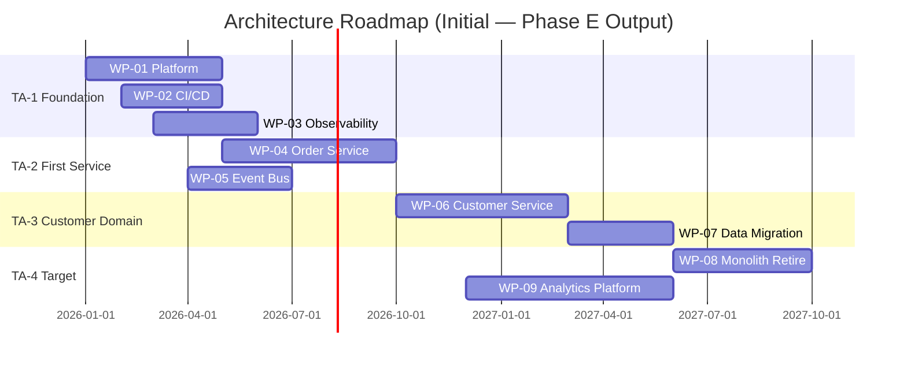

# Opportunities & Solutions (Phase E)

**TOGAF Reference:** Part II, Chapter 10 — Phase E
**Objective:** Identify the major implementation projects, formulate the initial implementation plan, and group the work into manageable, deliverable Transition Architectures.

> Phase E is the bridge from "what we want" (Phases B, C, D target architectures) to "how we get there". The output of Phase E is *Work Packages*, *Transition Architectures*, and an initial *Architecture Roadmap*. Phase F then turns this into a fully governed Migration Plan.

---

## Foundations

**Quick recall:** Phase E asks *what discrete chunks of work, in what order, will move the enterprise from baseline to target?* The answer is never one big-bang project — it is a sequence of incremental, value-delivering Transition Architectures.

The three central artefacts are:

1. **Implementation Factor Catalogue** — risks, dependencies, constraints to consider per work package
2. **Work Packages** — the units of delivery (each one valuable on its own)
3. **Transition Architectures** — coherent intermediate states the enterprise passes through

---

## Concepts & Relationships

```
Phase B/C/D Gap Analyses ──> Implementation Factors ──> Work Packages ──> Transition Architectures ──> Initial Roadmap
                                                                              │
                                                                              └──> Phase F (Migration Planning)
```

**Conceptual understanding:** a *Work Package* is a unit of delivery — typically 3–6 months, fully scoped, with a clear owner. A *Transition Architecture* is the architectural state that exists when a coherent set of Work Packages has completed. The roadmap shows the sequence of Transition Architectures.

---

## Execution Guidance

### Step 1 — Consolidate Gaps Across Phases

Pull every gap identified in Phases B, C (App + Data), and D into a single Gap Inventory:

| Gap ID | Source Phase | Description | Business Capability Impacted | Estimated Effort |
|---|---|---|---|---|
| G-01 | Phase B | No real-time order tracking capability | Order Management | M |
| G-02 | Phase C-App | Monolithic Order processing | Order Management | L |
| G-03 | Phase C-Data | Customer data not domain-owned | Customer Management | M |
| G-04 | Phase D | No container orchestration platform | Platform | L |
| G-05 | Phase D | No centralised observability | Operations | M |

### Step 2 — The 7R Framework (Implementation Strategy per Component)

**Guided practice:** for each existing component, choose one of the **7 R's**:

| Strategy | When to Use | Effort | Value |
|---|---|---|---|
| **Retain** | Working well; no business case to change | None | None |
| **Retire** | No longer needed; capability superseded | Low | Cost saving |
| **Rehost** ("lift & shift") | Move to new infra unchanged | Low | Foundation only |
| **Replatform** | Minor changes to leverage new platform | Medium | Moderate |
| **Repurchase** | Replace with SaaS / commercial product | Medium | High (if SaaS fits) |
| **Refactor / Re-architect** | Significant rewrite for new capabilities | High | High |
| **Relocate** | Move between hosting (e.g., DC → cloud) without OS-level changes | Low | Foundation |

For each application in scope, document the chosen R and the reason.

### Step 3 — Define Work Packages

A Work Package is the unit of delivery. Each must:

- Deliver value on its own (not require another package to be useful)
- Have a single accountable owner (named squad)
- Be sized for a 3–6 month delivery window
- Map to one or more Gap IDs from Step 1

**Work Package Template:**

```
Work Package: WP-01 — Containerisation Platform Foundation
Owner: Platform Squad
Duration: 4 months
Gaps Closed: G-04, G-05 (partially)
Strategy (7R): Replatform
Description:
  Stand up production-ready Kubernetes (EKS) cluster with CI/CD,
  observability stack (Prometheus, Grafana, Loki), and secrets management.
  Deliver to non-prod first, then production. Includes runbook,
  SRE on-call rotation, and chaos testing.
Deliverables:
  - Multi-AZ EKS cluster (non-prod + prod)
  - GitOps deployment via ArgoCD
  - Observability dashboards for golden signals
  - SRE runbook & incident response process
Success Criteria:
  - One pilot service deployed and observable
  - Mean deployment time < 15 min
  - 99.9% control-plane availability over 30 days
Dependencies: None (foundation)
Risks:
  - Talent gap in Kubernetes operations [Mitigation: 2× external SRE consultants]
  - Network architecture constraints [Mitigation: Network architecture review week 1]
```

### Step 4 — Group into Transition Architectures

A **Transition Architecture** is a coherent architectural state — the enterprise can pause here and operate stably. Group Work Packages so that each grouping leaves the enterprise in such a state.

Example for an order-platform modernisation:

| Transition | Includes WPs | State of the Enterprise |
|---|---|---|
| **TA-1: Foundation** | WP-01 (Platform), WP-02 (CI/CD), WP-03 (Observability) | Same monolith, but new platform ready |
| **TA-2: First Service Extracted** | WP-04 (Order Service), WP-05 (Event Bus) | Order processing on Order Service; rest unchanged |
| **TA-3: Customer Domain Owned** | WP-06 (Customer Service), WP-07 (Customer Data Migration) | Customer data domain-owned; legacy customer module deprecated |
| **TA-4: Target State** | WP-08 (Monolith Retire), WP-09 (Analytics Platform) | All target architecture realised |

### Step 5 — Initial Architecture Roadmap

Visualise the sequence:



This roadmap is **initial** — Phase F refines it with full prioritisation, dependencies, costs, and resource plans.

---

## Analysis & Insights

**Deep reasoning:** Phase E typically goes wrong by jumping straight to a roadmap without consolidating gaps or grouping into Transition Architectures. The result is a flat list of projects that never produces a stable intermediate state — there's no point at which the enterprise can pause if business priorities shift.

A second common failure: choosing **Refactor** by default. Most legacy components do not justify refactoring — Repurchase, Replatform, and Retire are usually cheaper and faster routes to similar value.

---

## Decision Frameworks

**Judgment & trade-offs:** when sequencing Work Packages, the recurring tensions are:

| Tension | Lean towards… when | Lean away when |
|---|---|---|
| **Foundation-first vs. value-first** | Team needs to learn the new platform | Business is impatient; value visible in 3 months matters more |
| **Big-bang cutover vs. strangler fig** | System is small and well-understood | Anything mission-critical or large |
| **All teams parallel vs. one-team-at-a-time** | Strong programme management; mature SRE | Limited governance bandwidth |
| **Build vs. buy for foundation** | Differentiating capability | Standard infrastructure (e.g., observability, IdP) |

---

## Target Outputs

- [ ] Consolidated Gap Inventory
- [ ] 7R decision per existing application
- [ ] Work Package Catalogue (with template completed for each)
- [ ] Transition Architecture definitions
- [ ] Initial Architecture Roadmap (Gantt or equivalent)
- [ ] Implementation Factor Catalogue (risks, dependencies, assumptions)
- [ ] Phase E ADD section drafted

**Synthesis exercise:** take three Work Packages from your current programme. For each, identify which Transition Architecture it completes, which gaps it closes, and what would happen if you delivered it *and stopped there*. If the enterprise would not be in a stable state after any of them, your Transition Architectures are wrong.

---

## Tools & Credible Sources

| Tool / Source | Use for | Notes |
|---|---|---|
| AWS / Azure / GCP "6R / 7R" migration guidance | Per-application strategy | Cloud-vendor framing of the same concept |
| TOGAF Standard 10ed — [Chapter 10](https://pubs.opengroup.org/architecture/togaf10-doc/arch/chap10.html) | Authoritative reference | Free online |
| Strangler Fig Pattern (Martin Fowler) | Incremental migration | `martinfowler.com/bliki/StranglerFigApplication.html` |

---

## Acceleration Using AI

LLMs can be used to:

- First-draft Work Package descriptions from a list of gaps and constraints
- Generate Mermaid Gantt code from a CSV of WP names + durations
- Cross-check whether a roadmap leaves the enterprise stable at each Transition Architecture

**Bias warning:** LLMs over-prefer Refactor. Always present the 7R table in the prompt and require justification for non-Retain choices.

---

## Common Mistakes

!!! failure "Roadmap without Transition Architectures"
    A flat roadmap (just a list of dated projects) leaves no stable intermediate state. Always group into TAs.

!!! warning "Refactor everywhere"
    Refactor is the most expensive R and rarely the right default. Prefer Retire, Repurchase, Replatform when applicable.

!!! tip "Pair with Phase F immediately"
    Phase E and Phase F are often run together. Phase E produces the *initial* plan; Phase F produces the *governed* plan with cost, resources, prioritisation.

---

## Related

- [Migration Planning (Phase F)](migration-planning.md) — paired phase
- [Implementation Governance (Phase G)](implementation-governance.md) — what happens once delivery starts
- [Engagement: Implementation](../../playbook/engagement/04-implementation.md) — the Track-B operational view
