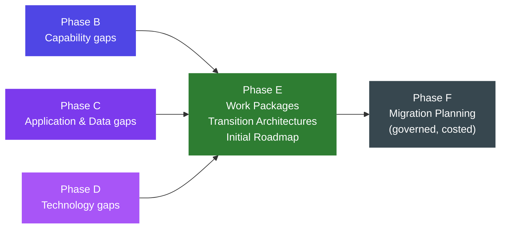
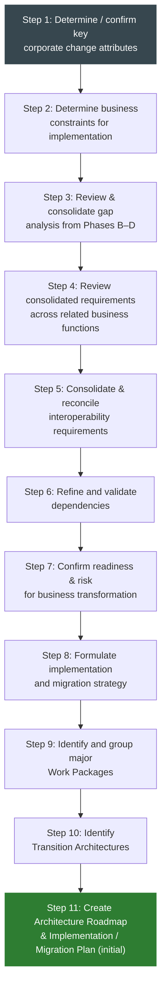
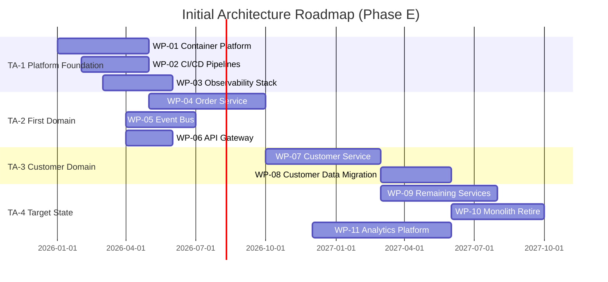

# Phase E — Opportunities & Solutions

**TOGAF Reference:** Part II, Chapter 10 — Phase E  
**Bloom level:** Recall → Comprehension → Application → Analysis → Evaluation → Synthesis  
**Audience:** Architecture practitioners; senior developers transitioning to solution architecture

> **From developer to solution architect — why Phase E matters to you:** As a lead developer you have planned sprints: broken down a feature backlog into deliverable increments, sequenced them by dependency, and tracked the result in a roadmap. Phase E is exactly this — but at architecture scope. Instead of user stories, the inputs are *architectural gaps* from Phases B–D. Instead of sprints, the outputs are *Work Packages* (3–6 month delivery units) and *Transition Architectures* (stable intermediate states). The architect's challenge in Phase E is not technical — it is the discipline of sequencing so that *every* intermediate state is a place the organisation could pause and still operate, not just a waypoint in a flight plan that only works if everything goes to plan.

---

## Bloom Layer A — Quick Recall

**At a glance:** Phase E turns the gaps from Phases B–D into a sequenced, deliverable roadmap of Work Packages and Transition Architectures.

| | |
|---|---|
| **In** | Gaps from Phases B, C, D; capability assessments; business constraints; risk register |
| **Out** | Work Package Catalogue; Transition Architectures; Initial Architecture Roadmap; Implementation Factor Catalogue |
| **Exit when** | Work Packages defined; Transition Architectures identified; initial roadmap approved by Architecture Board |
| **Feeds into** | Phase F (Migration Planning) — Phase E is the *initial* plan; Phase F is the *governed, costed, resourced* plan |
| **TOGAF Chapter** | Part II, Chapter 10 — [pubs.opengroup.org](https://pubs.opengroup.org/architecture/togaf10-doc/arch/chap10.html) |

**Three central artefacts:**

| Artefact | What it is | Developer analogy |
|---|---|---|
| **Work Package** | Discrete unit of delivery — 3–6 months; value on its own; single owner | Epic / initiative |
| **Transition Architecture** | Coherent stable state the enterprise reaches when a set of WPs completes | Releasable increment |
| **Architecture Roadmap (initial)** | Sequenced timeline of TAs and WPs | Release plan |

---

## Bloom Layer B — Conceptual Understanding

### Where Phase E fits and what it uniquely adds

Phases B, C, and D ask *what*. Phase E asks *how* and *in what order*. It is the only phase that explicitly converts architecture into a delivery plan.



> **Source:** ADM phase flow and Phase E inputs from TOGAF 10 Part II §10.1. The consolidation of B/C/D gaps into Phase E work packages is defined in §10.3 Step 3.

**Why Transition Architectures matter:** The single most common Phase E failure is producing a roadmap with no stable intermediate states — a flat list of projects that only "completes" when every project is done. Transition Architectures solve this: each TA is a state where the enterprise could pause, operate stably, and re-prioritise. If the organisation needs to stop after TA-2, it is still in a better, operable state than before.

**Developer analogy:** Feature flags and trunk-based development — every commit must leave the codebase deployable. Every Transition Architecture must leave the enterprise operable.

---

## Bloom Layer C — Guided Practice (Step-by-Step)

### TOGAF Phase E Step Sequence

The following sequence is defined in **TOGAF 10 Part II, Chapter 10, §10.3** (Steps 1–11).



> **Source:** TOGAF Standard 10th Edition, Part II, Chapter 10, §10.3 — Phase E Steps 1–11. [pubs.opengroup.org/architecture/togaf10-doc/arch/chap10.html](https://pubs.opengroup.org/architecture/togaf10-doc/arch/chap10.html)

#### Risks when steps are skipped

| If you skip … | Downstream risk |
|---|---|
| Step 1 (corporate change attributes) | Work Packages ignore organisational change capacity; delivery fails in Phase F |
| Step 2 (business constraints) | Roadmap planned without budget/resource reality; Phase F reschedules everything |
| Step 3 (gap consolidation) | Duplicate work packages; gaps missed entirely; Phase F surprises |
| Step 5 (interoperability) | Work Packages delivered in isolation; integration failures in later TAs |
| Step 6 (dependency validation) | Work Package sequencing is wrong; TAs are not actually stable |
| Step 7 (readiness / risk) | Transformation risk carried into Phase F without mitigation; programme fails |
| Step 10 (Transition Architectures) | No stable intermediate states; roadmap cannot be paused safely |

---

### Inputs

| Input | Source | Developer translation |
|---|---|---|
| Gap analyses (B, C, D) | Phases B, C, D | "All the things we need to build, change, or retire" |
| Architecture Vision | Phase A | "The target we are planning to reach; the constraints we must meet" |
| Business constraints | Business sponsors / PMO | "Budget, headcount, timeline, org change capacity" |
| Existing programme list | PMO / Programme board | "What's already in flight that we must not conflict with" |
| Transformation Readiness Assessment | Phase A §6.3 Step 5 | "How much change can the organisation absorb?" |
| Architecture Principles | Preliminary / Phase A | "The design constraints our work packages must comply with" |

---

### Technique 1 — Gap Inventory Consolidation

Pull every gap from Phases B, C (Application + Data), and D into a single table before grouping into work packages. Without this step, work packages are planned in phase-silos and dependencies are invisible.

| Gap ID | Source | Description | Capability impacted | Priority | Effort |
|---|---|---|---|---|---|
| G-B-01 | Phase B | No real-time order tracking capability | Order Management | High | M |
| G-B-02 | Phase B | Customer segmentation is manual / delayed | Customer Management | Medium | S |
| G-C-01 | Phase C-App | Monolithic order processing service | Order Management | High | L |
| G-C-02 | Phase C-App | No API gateway; direct DB access in places | Platform | High | M |
| G-C-03 | Phase C-Data | Customer data not domain-owned; shared schema | Customer Management | Medium | L |
| G-D-01 | Phase D | No container orchestration platform | Platform | High | L |
| G-D-02 | Phase D | No centralised observability | Operations | High | M |
| G-D-03 | Phase D | Legacy secrets management (env vars) | Security | Critical | S |

---

### Technique 2 — 7R Strategy per Component

For each *existing* component in scope, choose a migration strategy. Applying Refactor by default is the most common Phase E cost overrun.

| Strategy | When to use | Effort | Value delivered |
|---|---|---|---|
| **Retain** | Working well; no business case to change | None | None (and that's fine) |
| **Retire** | Capability superseded; no active use | Low | Cost saving; tech debt reduction |
| **Rehost** (lift & shift) | Move to new infrastructure unchanged | Low | Foundation for future change only |
| **Replatform** | Minor adaptation to leverage new platform without rewriting | Medium | Moderate; leverages platform benefits |
| **Repurchase** | Replace with SaaS / COTS product | Medium | High *if* the SaaS fits the use case |
| **Refactor / Re-architect** | Significant rewrite to enable new capabilities | High | High — but only if the capability truly requires it |
| **Relocate** | Move between hosting environments without OS-level changes | Low | Foundation |

> **Source:** 7R framework adapted from AWS Migration Acceleration Programme (MAP) 7 Rs, Gartner "Five Rs for Rationalizing the Application Portfolio" (2010), and similar frameworks from Azure and GCP. TOGAF 10 does not prescribe a specific R-classification; this framework fills the gap as a widely used industry pattern.

---

### Technique 3 — Work Package Definition

**What it is:** A Work Package is the atomic unit of delivery in Phase E. Each must deliver value independently — not "once everything else is done."

``` markdown
Work Package: WP-{NNN} — {Name}
Owner: {Squad / team name}
Duration: {N months}
Gaps closed: {G-X-NN, …}
7R strategy: {Replatform / Refactor / …}

Description:
  {What this work package delivers — functional and technical outcomes.
  Not implementation detail — architecture-level description.}

Deliverables:
  - {Deliverable 1}
  - {Deliverable 2}
  - {Deliverable 3}

Success criteria (measurable):
  - {KPI or acceptance criterion 1}
  - {KPI or acceptance criterion 2}

Dependencies: {WP-NNN (must complete first); external dependency}
Risks:
  - {Risk description} [Mitigation: {action}]
```

**Example:**

```markdown
Work Package: WP-01 — Container Platform Foundation
Owner: Platform Squad
Duration: 4 months
Gaps closed: G-D-01, G-D-02 (partial), G-D-03
7R strategy: Replatform (infrastructure)

Description:
  Provision production-ready managed container platform with multi-AZ deployment,
  IaC-managed (Terraform), GitOps deployment pipeline, centralised observability
  (OTel + Grafana), and managed secrets. Deliver non-prod first, then production.
  Includes runbooks and SRE on-call rotation.

Deliverables:
  - Multi-AZ container cluster (non-prod + prod) via Terraform
  - GitOps deployment pipeline (GitHub Actions + ArgoCD)
  - Observability stack: OTel traces, Prometheus metrics, structured logs, Grafana
  - Secrets migrated to managed secrets service
  - Incident runbook and on-call rotation established

Success criteria:
  - One pilot service deployed, observable, and deployed via pipeline
  - Mean deployment time < 15 min
  - All secrets confirmed out of env vars and source code
  - 99.9% control-plane availability over 30 days

Dependencies: None (foundation)
Risks:
  - Kubernetes operations skill gap [Mitigation: 2× external SRE consultants; 12-week engagement]
  - Network architecture constraints [Mitigation: Network architecture review in week 1]
```

---

### Technique 4 — Transition Architectures

**What it is:** A Transition Architecture is a coherent, stable intermediate state the enterprise reaches when a related set of Work Packages completes. The enterprise can pause at each TA and operate sustainably.

> **Source:** Transition Architecture concept from TOGAF 10 Part II §10.3 Step 10. The definition — "architecturally coherent, implementable, and able to deliver business value in its own right" — is from TOGAF 10 §10.2.2.

**Example — e-commerce platform modernisation:**

| Transition Architecture | Work Packages included | State of the enterprise at completion |
|---|---|---|
| **TA-1: Platform Foundation** | WP-01 (Container Platform), WP-02 (CI/CD), WP-03 (Observability) | Legacy monolith still running; new platform ready; first service can be migrated |
| **TA-2: First Domain Extracted** | WP-04 (Order Service), WP-05 (Event Bus), WP-06 (API Gateway) | Order processing on extracted service; rest of monolith unchanged; enterprise stable |
| **TA-3: Customer Domain** | WP-07 (Customer Service), WP-08 (Customer Data Migration) | Customer data domain-owned; Customer API live; legacy customer module retired |
| **TA-4: Target State** | WP-09 (Remaining Services), WP-10 (Monolith Retire), WP-11 (Analytics Platform) | Full target architecture realised; monolith retired |

**Stability test for each TA:** *If delivery stops here permanently, is the enterprise in a state it can operate, maintain, and support?* If not, the grouping is wrong.

---

### Technique 5 — Initial Architecture Roadmap

Phase E produces an *initial* roadmap. Phase F refines it with full prioritisation, cost, and resource plans. Do not over-engineer the Phase E roadmap — its job is to show the sequence and the TA groupings.



> **Source:** Gantt roadmap visualisation aligned with TOGAF 10 Phase E Architecture Roadmap output (§10.3 Step 11). The phased delivery structure mirrors SAFe (Scaled Agile Framework) Program Increment planning — where each PI corresponds approximately to one Transition Architecture.

---

### Implementation Factor Catalogue

Record the risks, dependencies, and constraints that affect work package delivery:

| Factor ID | Type | Description | Affects WP | Owner | Mitigation |
|---|---|---|---|---|---|
| IF-01 | Risk | Kubernetes skill gap — no internal expertise | WP-01 | Platform Arch | External SRE engagement |
| IF-02 | Constraint | Budget capped at £2M for TA-1 and TA-2 | WP-01–06 | Programme Manager | Right-size scope; phased platform |
| IF-03 | Dependency | Customer data migration requires GDPR DPA | WP-08 | Legal / Data Arch | DPA engagement in Q1 |
| IF-04 | Assumption | Monolith is adequately tested for service extraction | WP-04 | Squad Tech Lead | Audit test coverage in week 1 |

---

## Output Artifacts — Phase E Exit Criteria

- [ ] Consolidated Gap Inventory — all B/C/D gaps in one table
- [ ] 7R decision documented per component in scope
- [ ] Work Package Catalogue — template completed for each WP
- [ ] Transition Architecture definitions — stability test passed for each TA
- [ ] Initial Architecture Roadmap (Gantt or equivalent)
- [ ] Implementation Factor Catalogue (risks, dependencies, assumptions, constraints)
- [ ] Phase E ADD section drafted
- [ ] Architecture Board review and approval of initial roadmap

---

## Bloom Layer D — Tools

### Roadmap & Portfolio Planning Tools

| Tool | Purpose in Phase E | Pros | Cons | Cost | Link |
|---|---|---|---|---|---|
| **LeanIX** | Work package and roadmap management integrated with EA repository | Native architecture roadmap; links to applications and capabilities; dependency visualisation | Enterprise pricing; complex setup | Enterprise ($$$$) | [leanix.net](https://www.leanix.net) |
| **Jira / Advanced Roadmaps** | Work package tracking as Epics; dependency links; Gantt view | Familiar to delivery teams; links to stories; accessible | Not architecture-native; no TA concept built in; becomes a PM tool | Free (team); from $7.75/user/mo | [atlassian.com/software/jira](https://www.atlassian.com/software/jira) |
| **Miro** | Gap consolidation workshops; Transition Architecture whiteboarding | Excellent for collaborative workshops; sticky notes → structured table | Not a repository; results must be exported | Free tier; paid from ~$8/user/mo | [miro.com](https://miro.com) |
| **draw.io** | Roadmap diagrams, dependency maps, TA state diagrams | Free; offline; Git-friendly; no vendor lock-in | No automated dependency tracking | Free | [diagrams.net](https://www.diagrams.net) |
| **Azure DevOps (Boards + Epics)** | Work package definition and dependency tracking in Microsoft environments | Integrated with Azure pipelines; good Gantt view | Microsoft-centric; limited architecture context | Free (up to 5 users); from $6/user/mo | [azure.microsoft.com/services/devops](https://azure.microsoft.com/services/devops/) |
| **Mermaid (this site)** | Gantt charts as code; dependency diagrams | Version-controlled; diff-friendly; embedded in Markdown | No interactive editing; limited formatting control | Free | [mermaid.js.org](https://mermaid.js.org) |

---

## Bloom Layer E — Decision Frameworks

| Phase E decision | Lean towards when | Lean away when | Risk if wrong |
|---|---|---|---|
| **Foundation-first vs. value-first sequencing** | Team needs to learn the new platform; foundational gaps block everything | Business requires visible value in < 3 months | Foundation-first too long: stakeholder confidence lost; value-first without foundation: first service delivery fails in production |
| **Strangler Fig vs. big-bang cutover** | Any mission-critical or large system | System is small, well-understood, with low traffic | Big-bang on large system: highest risk of outage; Strangler too gradual: never completes |
| **Parallel delivery (all teams) vs. sequential (one team at a time)** | Strong programme management; mature SRE; independent domains | Limited governance bandwidth; cross-domain coupling | Parallel without governance: work packages conflict; sequential too slow: stakeholders lose confidence |
| **Buy/SaaS vs. build for platform capabilities** | Non-differentiating capability (observability, IdP, API gateway) | Core differentiating capability; IP; compliance prevents SaaS | Build what should be bought: maintenance drag; buy what should be built: capability gap, vendor dependency |
| **Many small WPs vs. few large WPs** | High change uncertainty; need frequent re-prioritisation | Stable programme; strong delivery teams with clear scope | Too small: coordination overhead; too large: WP never "done" |

---

## Bloom Layer E — Judgment & Trade-offs

| Phase E question | Lean towards when | Lean away when | Failure mode if wrong |
|---|---|---|---|
| **Refactor vs. Retire / Repurchase** | Genuine differentiating capability; reuse is not possible | Standard capability; SaaS alternative exists; pure technical debt | Refactor by default → highest Phase E cost; most common overrun |
| **Granular Work Packages vs. coarse** | Uncertain requirements; team learning; business priorities may shift | Fixed scope; stable requirements; strong delivery team | Too coarse: never actually completes; too granular: coordination > delivery |
| **Big Transition Architecture vs. many small TAs** | Simple programme; few dependencies | Complex programme; multiple squads; uncertain delivery | Big TA: no stable intermediate state; business cannot pause; too many TAs: planning overhead exceeds value |
| **Detailed Phase E plan vs. lightweight** | Regulated programme; fixed budget; board-level visibility needed | Agile programme; iterative; Phase F will plan in detail | Too detailed: plan is wrong by the time delivery starts; too light: Phase F has no anchor |
| **Prioritise by value vs. by dependency** | Strong business sponsor alignment; stable dependencies | High-coupling architecture; dependency violations are costly | Value-first without dependency awareness: later WPs block earlier ones; dependency-first without value: programme loses sponsor support |

---

## Bloom Layer F — Synthesis Exercise

**Scenario:** You are the lead architect for a global logistics company. Phases B, C, and D are complete. The gap analysis has produced 22 gaps across 5 domains: Fleet Management, Parcel Tracking, Customer Portal, Data & Analytics, and Platform/Infrastructure. The programme has a 24-month window and a fixed budget of £8M. The board wants visible customer value within 6 months.

1. **Recall:** Name the three Phase E artefacts and state the TOGAF-defined criteria for a Transition Architecture to be valid.
2. **Comprehension:** Explain why a flat roadmap (dated project list) fails the Phase E stability requirement — and how Transition Architectures fix it.
3. **Application:** Group the 22 gaps into 4 Transition Architectures. Define the enterprise state at the end of each TA, and perform the stability test for each.
4. **Analysis:** The board's 6-month value requirement conflicts with the platform team's estimate that the Foundation TA will take 5 months and produce nothing visible to customers. Analyse the trade-off. Propose and defend a sequencing that satisfies both constraints — or make the case that one constraint must change.
5. **Evaluation:** Three of the 22 gaps relate to the legacy Parcel Tracking system. The 7R assessment produces: two teams arguing Refactor, one arguing Repurchase (commercial SaaS), one arguing Retire and rebuild. Evaluate all four positions, including cost, risk, and time-to-value implications. Which would you recommend and why?
6. **Synthesis:** Produce the Implementation Factor Catalogue (top 10 factors), the initial Gantt roadmap, and the Work Package template for the highest-risk WP in TA-1. Include measurable success criteria that the Architecture Board can validate at the end of TA-1.

> A roadmap that only works if everything goes to plan is not a roadmap. It is a wish. A Phase E plan is built around Transition Architectures — intermediate states where the enterprise is stable enough that the plan *can* change without catastrophe.

---

## Acceleration Using AI

| Use case | Prompt pattern | Watch for |
|---|---|---|
| **Gap inventory consolidation** | "Here are 15 gaps from Phase B, C, and D [paste table]. Group them by business capability, identify dependencies, and flag any that could be addressed by the same work package." | May miss cross-domain dependencies; groups may not align to delivery team boundaries |
| **7R classification** | "Here is a list of applications [describe]. For each, recommend a 7R strategy with a brief rationale. Prioritise Retain, Retire, and Repurchase before Refactor." | Will still over-recommend Refactor; always counter-prompt for the Buy alternative |
| **Work Package first-draft** | "Draft a Work Package template for [WP name]. It closes gaps [list]. It uses [technology]. The success criteria must be measurable." | Generic success criteria; may miss domain-specific acceptance conditions |
| **Gantt chart generation** | "Generate a Mermaid Gantt chart for these Work Packages [list with durations and dependencies]. Group by Transition Architecture." | Dependencies may be wrong; TA groupings may not be coherent; always validate TAs manually |
| **Stability test** | "Here are my Transition Architectures [describe each]. For each, is the enterprise in a state it could operate in permanently? If not, what is missing?" | LLM can suggest theoretical issues but doesn't know your specific operational context |

!!! warning "Bias to watch"
    LLMs default to Refactor as the migration strategy — it produces the most interesting technical content to describe. Always prompt explicitly for the cost and time implications of Refactor versus Repurchase or Retire. The cheapest architecturally correct answer is frequently "buy the SaaS and move on."

---

## Common Mistakes

!!! danger "Roadmap without Transition Architectures"
    A flat roadmap (just a list of dated projects) leaves no stable intermediate state. If funding stops or priorities shift, the enterprise is left mid-transformation with no operable state. Always group work packages into TAs.

!!! failure "Refactor everywhere"
    Refactor is the most expensive 7R strategy and is rarely the right default. Many legacy systems should be Retired (capability no longer needed), Repurchased (SaaS does the job), or Replatformed (same app, better infrastructure). Apply Refactor only where the capability is genuinely differentiating and cannot be served by an existing product.

!!! warning "Phase E roadmap too detailed"
    Phase E produces an *initial* roadmap — sequencing and TA groupings. Phase F produces the governed, costed, resourced plan. Over-engineering the Phase E roadmap consumes planning time that belongs in Phase F, and produces a detailed plan that will be wrong by the time Phase F begins.

!!! tip "Run Phase E and F together"
    In practice, Phase E and Phase F are frequently run as a single planning exercise, especially for programmes shorter than 18 months. Phase E sets the structure (WPs and TAs); Phase F governs the delivery (costs, resources, prioritisation). The distinction is analytical, not always procedural.

---

## Credible Sources & Further Reading

| Resource | Type | What it adds | Link |
|---|---|---|---|
| TOGAF 10 Part II Chapter 10 | Primary standard | Authoritative Phase E steps, inputs, outputs, artefacts | [pubs.opengroup.org](https://pubs.opengroup.org/architecture/togaf10-doc/arch/chap10.html) |
| AWS Migration Acceleration Programme — 7 Rs | Framework | Per-application migration strategy taxonomy | [aws.amazon.com/blogs/enterprise-strategy/6-strategies-for-migrating-applications-to-the-cloud](https://aws.amazon.com/blogs/enterprise-strategy/6-strategies-for-migrating-applications-to-the-cloud/) |
| Strangler Fig Pattern (Martin Fowler) | Pattern | Incremental service extraction from monolith | [martinfowler.com/bliki/StranglerFigApplication.html](https://martinfowler.com/bliki/StranglerFigApplication.html) |
| SAFe — Program Increment Planning | Framework | Scaled agile equivalent of Phase E; PI = Transition Architecture analogue | [scaledagileframework.com/pi-planning](https://scaledagileframework.com/pi-planning/) |
| Building Evolutionary Architectures (Ford, Parsons, Kua — 2017) | Book | Incremental architecture delivery; fitness functions as WP acceptance criteria | [oreilly.com](https://www.oreilly.com/library/view/building-evolutionary-architectures/9781491986356/) |
| Accelerate (Forsgren, Humble, Kim — 2018) | Book | DORA metrics for validating WP success criteria; deployment frequency as a Phase E KPI | [itrevolution.com/accelerate-book](https://itrevolution.com/accelerate-book/) |
| Team Topologies (Skelton & Pais — 2019) | Book | Work Package ownership aligned to team topologies; stream-aligned teams as WP owners | [teamtopologies.com](https://teamtopologies.com) |
| The Art of Business Value (Schwartz — 2016) | Book | Why value-first sequencing is not just a business demand but an architecture principle | [itrevolution.com](https://itrevolution.com/the-art-of-business-value/) |
